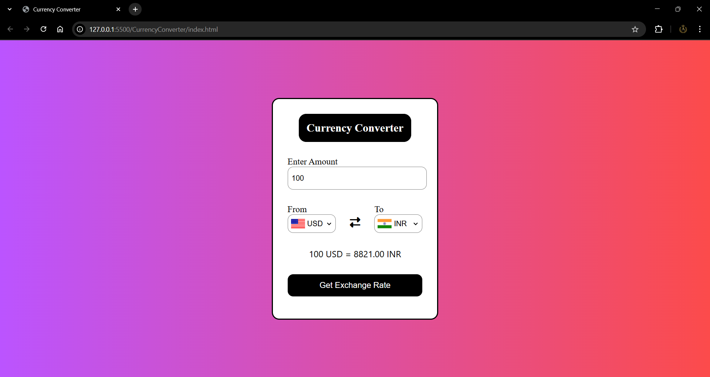

# Currency Converter

A simple currency converter that converts between different currencies using live exchange rates.

## Features

- Real-time exchange rates from ExchangeRate API
- Country flags for visual currency selection
- Input validation and error handling
- Clean, responsive design

## Preview

## JavaScript Concepts Used

- **DOM Manipulation**: querySelector, createElement, event listeners
- **Async/Await**: Fetching data from external APIs
- **Object Iteration**: Populating dropdowns from currency data
- **Event Handling**: Form submission and dropdown changes
- **API Integration**: Working with ExchangeRate and Flags APIs

## How to Use

1. Enter amount to convert
2. Select source and target currencies
3. Click "Get Exchange Rate" for results

Built with vanilla JavaScript, HTML, and CSS.

## Credits

Thanks to Shradha Khapra for explaining the logic and concepts of JS involved behind its implementation.

