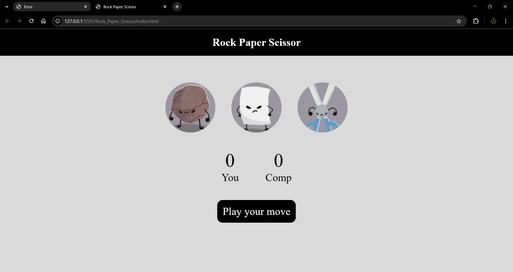

# Rock Paper Scissor

Rock, Paper, Scissor game built with HTML, CSS, and JavaScript.

## JavaScript Concepts Used :
- DOM selection and manipulation using `querySelector` and `querySelectorAll`
- Event handling with `addEventListener`
- Arrow functions and function expressions
- Random value generation with `Math.random()` and `Math.floor()`
- Conditional logic and ternary operators
- State management with variables (`userScore`, `compScore`)
- Dynamic UI updates based on game state
- String interpolation with template literals
